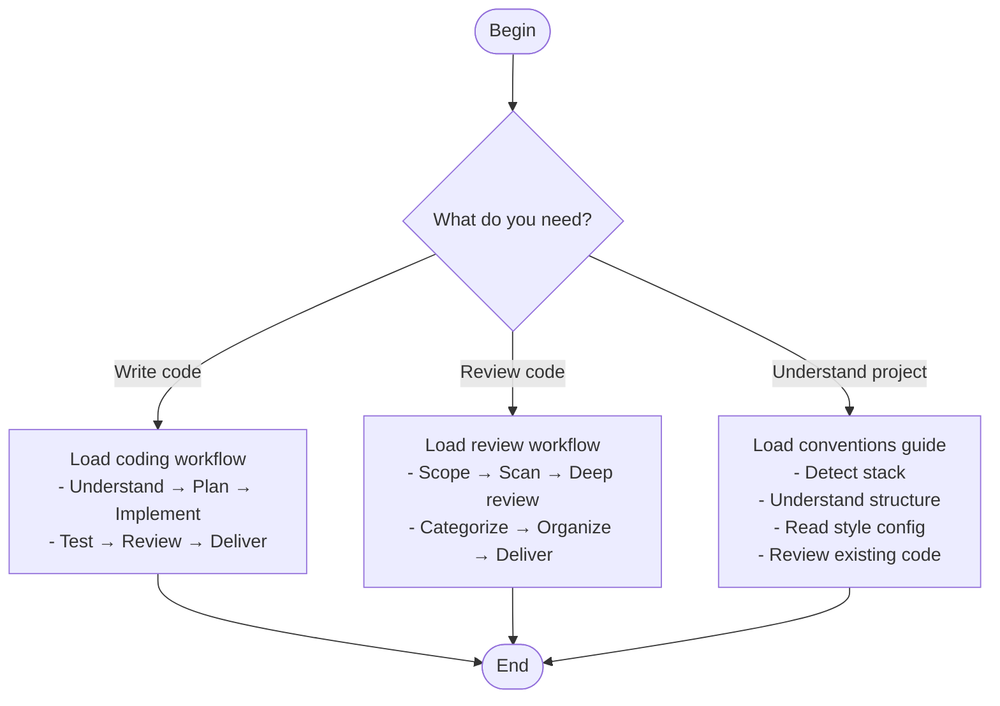

# Development Workflow

Orchestrator for all development tasks. Routes to the appropriate sub-workflow.

## Sub-workflows

This skill coordinates three development activities:

### Coding
When you need to implement features, fix bugs, or refactor:
- Phase 1: Understand the task and requirements
- Phase 2: Plan implementation steps
- Phase 3: Implement code
- Phase 4: Test thoroughly
- Phase 5: Self-review
- Phase 6: Deliver with summary

### Code Review
When you need to review code (your own or others'):
- Step 1: Understand scope and context
- Step 2: Quick scan for blockers
- Step 3: Deep review by category
- Step 4: Categorize findings (critical/warning/suggestion/nitpick/praise)
- Step 5: Organize and deliver feedback

### Project Conventions
When joining or exploring a codebase:
- Detect tech stack from config files
- Understand directory structure
- Read style and linting configs
- Review representative code samples
- Check existing documentation

## References

- **Language patterns**: See `references/language-patterns.md`
- **Testing guide**: See `references/testing-guide.md`
- **Review checklist**: See `references/review-checklist.md`
- **Anti-patterns**: See `references/anti-patterns.md`
- **Language conventions**: See `references/language-conventions.md`
- **Framework patterns**: See `references/framework-patterns.md`
- **Architecture templates**: See `references/architecture-templates.md`
