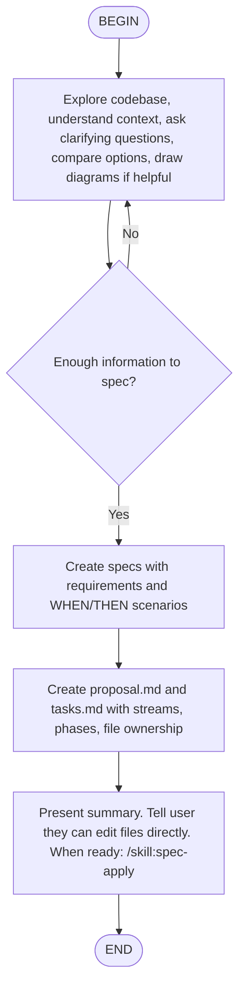

## Paths

All spec data lives at `.kimi/openspec/` (add to .gitignore):

```
.kimi/openspec/
├── capabilities.yaml              ← manifest of archived capabilities
└── changes/
    └── <change-name>/
        ├── specs/
        │   └── <capability>/spec.md
        ├── proposal.md
        └── tasks.md
```

## Input

The user's request should include a change name (kebab-case) OR a description of what they want to build. If no input provided, ask what they want to build and derive a kebab-case name.

## Steps

### Step 1: Explore

Read the codebase to understand context:

- Scan project structure: `ls`, file tree, package.json, config files
- Read relevant source files to understand architecture
- Read `.kimi/openspec/capabilities.yaml` if it exists to understand existing capabilities
- Ask clarifying questions if the problem is ambiguous
- Compare options if multiple approaches exist
- Draw ASCII diagrams if they help clarify thinking

**Important**: Do NOT write any code or create files during explore. Only read and think.

### Step 2: Create Specs

Create the change directory and spec files:

1. Create directory: `mkdir -p .kimi/openspec/changes/<name>/specs/<capability>`
2. For each capability the change introduces, create `specs/<capability>/spec.md`

**Spec format** (follow exactly):

```markdown
# Capability: <name>

### Requirement: <requirement-name>
<Description using SHALL/MUST for normative language.>

#### Scenario: <scenario-name>
- WHEN <condition>
- THEN <expected result>

#### Scenario: <another-scenario>
- WHEN <condition>
- THEN <expected result>
```

Rules:
- Every requirement MUST have at least one scenario
- Scenarios MUST use exactly 4 hashtags `####`
- Use SHALL/MUST, avoid should/may
- Each scenario is a potential test case

### Step 3: Create Proposal

Create `.kimi/openspec/changes/<name>/proposal.md`:

```markdown
# Proposal: <change-name>

## Why
<1-2 sentences on the problem or opportunity.>

## What Changes
- <bullet list of changes, mark breaking changes with **BREAKING**>

## Specs
- <capability-1>: <brief description>
- <capability-2>: <brief description>

## Impact
- <affected code, APIs, dependencies, systems>

## Streams

| Stream | Scope | Files | Specs |
|--------|-------|-------|-------|
| <name> | <scope> | <file glob> | <capability> |
```

### Step 4: Create Tasks

Create `.kimi/openspec/changes/<name>/tasks.md` with parallel-safe structure.

**Task generation rules**:

1. **Analyze complexity**
   - Small (1-3 tasks): 1 agent, sequential
   - Medium (4-8 tasks): 2 agents, 2-3 phases
   - Large (9+ tasks): 3 agents, 3+ phases
   - Max 3 agents, never more

2. **Identify file boundaries**
   - Map each task to specific files it will modify
   - Tasks that share files MUST be in the same stream
   - Tasks with independent files CAN be in different streams

3. **Group into streams**
   - Stream = logical grouping by scope (data/auth/api/etc.)
   - Each stream has clear file boundaries
   - Streams must not overlap in files

4. **Arrange into phases**
   - Phase 1: tasks with no dependencies (foundation)
   - Phase N: tasks that depend on earlier phases
   - Within a phase, streams run in parallel

5. **Annotate each task**
   - `files:` which files will be modified
   - `spec:` which requirement it satisfies
   - `depends:` task IDs it needs completed first (cross-stream only)

**Tasks format**:

```markdown
# Tasks: <change-name>

## Streams Overview

| Stream | Scope | Files | Specs |
|--------|-------|-------|-------|
| <name> | <scope> | <glob> | <capability> |

## Phase 1 (parallel: <N> agents)

### Stream: <stream-name>
- [ ] <ID> <task description>
      files: <file paths>
      spec: <capability> → "<requirement>"

### Stream: <other-stream>
- [ ] <ID> <task description>
      files: <file paths>

## Phase 2 (parallel: <N> agents, needs: Phase 1)

### Stream: <stream-name>
- [ ] <ID> <task description>
      files: <file paths>
      spec: <capability> → "<requirement>"
      depends: <ID1>, <ID2>

## Sequential (needs: all phases)
- [ ] <ID> <task description>
      files: <file paths>
```

Task ID convention:
- Use stream prefix: `A1, A2...` for stream A, `B1, B2...` for stream B, etc.
- Or `D1, D2...` for sequential/done tasks at the end

### Step 5: Handoff

Present a summary to the user:

```
Created change: <name>

Specs:
  - <capability>: <N> requirements, <M> scenarios

Proposal: why, what changes, impact

Tasks: <N> tasks in <P> phases, <S> streams
  Phase 1: <N> tasks (parallel: <X> agents)
  Phase 2: <N> tasks (parallel: <X> agents)
  ...

Files are at .kimi/openspec/changes/<name>/
You can edit any file directly to adjust specs, proposal, or tasks.

When ready: /flow:spec-apply
```

## Guardrails

- NEVER write code during propose, only spec/planning files
- Read `.kimi/openspec/capabilities.yaml` first if it exists
- Always create specs BEFORE proposal and tasks
- Tasks must have file ownership annotations for parallel safety
- Max 3 streams/agents
- If a change with that name already exists, ask user what to do
- All paths relative to project root
